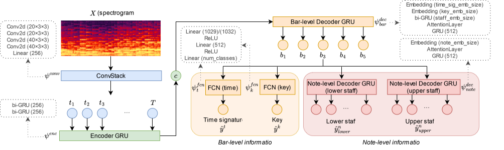
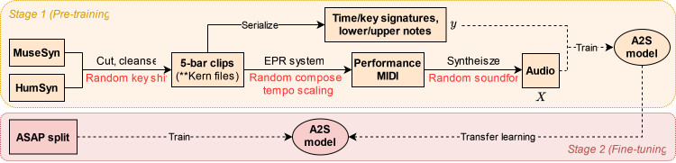

# End-to-End Real-World Polyphonic Piano Audio-to-Score Transcription with Hierarchical Decoding
<div align=center>

</div>
<div align=center>

</div>

## Installation

1. Clone this repository and create a conda environment with the provided dependencies:
```bash
git clone --recursive https://github.com/wei-zeng98/piano-a2s.git
cd piano-a2s
conda env create -f environment.yaml
conda activate a2s2024
```

2. Install Fluidsynth and FFmpeg, which is used to synthesize the audios:
```bash
sudo apt-get install fluidsynth ffmpeg
```

3. Get Humdrum extra tools.

You can choose either a) or b) to get the Humdrum extra tools.

a) Build from source:

```bash
git clone https://github.com/mangelroman/humextra.git
cd humextra
make library extractx hum2xml tiefix transpose
cd ..
```

b) Directly download the compiled executable binary files from [the Humdrum website](https://extras.humdrum.org/): [extractx](https://extras.humdrum.org/man/extractx/), [hum2xml](https://extras.humdrum.org/man/hum2xml/), [tiefix](https://extras.humdrum.org/man/tiefix/), [transpose](https://extras.humdrum.org/man/transpose/)

Once have builded/downloaded the Humdrum extra tools, add the folder containing the binary files to `$PATH`.

4. Install Verovio:

```bash
git clone https://github.com/rism-digital/verovio.git
cd verovio/tools
cmake ../cmake
make
sudo make install
cd ../..
```

If you do not install Verovio, you need to use the -r option to set the resource directory `./verovio/data` in `data_processing/render.py` where the command line is needed. You may refer to the [guide](https://book.verovio.org/installing-or-building-from-sources/command-line.html#building-on-macos-or-linux) for more details.

5. Clone VirtuosoNet

This step should already be done in 1 as specified by `--recursive`. However, you will probably encounter the error: `xml.etree.ElementTree.Element` object has no attribute `getchildren` when using VirtuosoNet. This is because in Python 3.9, the method `xml.etree.ElementTree.Element.getchildren` does not work anymore. You may refer to [this issue](https://github.com/jdasam/virtuosoNet/issues/14/) to solve the problem.

## Preparing Datasets

### Get MuseSyn

1. Request access to MuseSyn via https://zenodo.org/records/4527460.

2. Copy the XML files in MuseSyn for further processing:

```bash
cp -r path/to/MuseSyn/xml data_processing/xml/
```

### Get HumSyn

Get the kern files for HumSyn dataset:
```bash
chomd +x data_processing/get_kern.sh
bash data_processing/get_kern.sh
```

### Data synthesizing

1. Change the `workspace` in both `hparams/pretrain.yaml` and `hparams/finetune.yaml` to your own path, which is used for saving synthesized data and trained models etc.

2. Synethesizing:
```python
python data_processing/render.py
```
Synthesized dataset will be saved at `workspace` as indicated in `hparams/pretrain.yaml`.

### Prepare ASAP

Please refer to the [ASAP repo](https://github.com/fosfrancesco/asap-dataset) and prepare the ASAP dataset. Once finished, set the `asap_folder` in `hparams/finetune.yaml` to the ASAP dataset folder, and run:

```python
python datasets/asap.py
```

## Train

### Pretrain
```python
python pretrain.py hparams/pretrain.yaml
```

To use multiple GPUs (e.g. use 4 GPUs including CUDA:0, CUDA:1, CUDA:2 and CUDA:3):
```python
CUDA_VISIBLE_DEVICES=0,1,2,3 torchrun --nproc_per_node=4 pretrain.py hparams/pretrain.yaml
```

### Finetune
```python
python finetune.py hparams/finetune.yaml
```

To use multiple GPUs (e.g. use 4 GPUs including CUDA:0, CUDA:1, CUDA:2 and CUDA:3):
```python
CUDA_VISIBLE_DEVICES=0,1,2,3 torchrun --nproc_per_node=4 finetune.py hparams/finetune.yaml
```

## Evaluate
```python
python evaluate.py
```